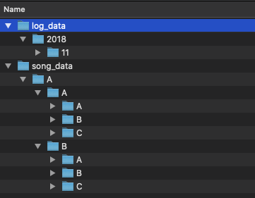

# Project: Data Modeling with Postgres

Author: Tianlin He

Date: 12 Aug 2020

Tag: #Udacity #Data Engineering 

---

## Song play analysis

A startup called Sparkify wants to analyse the data they have been collected on songs and user activity on their music streaming app, with a particular interest in the songs that are listened by the users. The tasks of this project include:

1. Query the data in the form of JSON logs from two local directories
2. Create a Postgres database schema and ETL pipeline based on the queries
3. Test the database and pipeline by running queries and validate with the expected results

---

## Dataset 

The JSON data reside in two local directories with structure:



The log data record user activities (user id, user level etc), while the song data contain information about songs (artist, year etc).

---

## Schema for song play analysis

We will create a **star schema** optimised for queries on song play analysis, which include a **fact table** and four **dimension tables**:

### Fact table: 

	* `songplays` Records in log data associated with song plays in the app

### Dimension tables:

* `users` Users in the app
* songs` Songs in music database` 
* `artists` Artists in music database
* `time` Timestamps of records in log data broken down into specific time units (hour, day, week etc)

---

## Project Steps

The project is developed in a local environment (MacOS) with detailed steps in [step-by-step-data-modelling-locally](dm_by_step.ipynb). In addition, there are several tips:

#### CREATE TABLE in `sql_queries.py`

1. For a typical data engineering task, the datatypes columns were not predefined. Thus they have to be manually added by inspecting the data files
2. Don't forget to define a primary key (PK) for each table

### INSERT in `sql_queries.py`

1. `ON CONFLICT (PK) DO action` in the case of duplicated rows

---

## Test the database

Once we built the database, we can run some queries in [test.ipynb](test.ipynb):

### Table `songplays`

```zsh
%sql SELECT COUNT(*) FROM songplays;
```

There are $6820$ rows in  `songplays`.

```zsh
%sql SELECT * FROM songplays WHERE song_id IS NOT NULL;
```

| songplay_id |                 start_time | user_id | level |            song_id |          artist_id | session_id |                           location |                                                   user_agent |
| ----------: | -------------------------: | ------: | ----: | -----------------: | -----------------: | ---------: | ---------------------------------: | -----------------------------------------------------------: |
|        5537 | 2018-11-21 21:56:47.796000 |      15 |  paid | SOZCTXZ12AB0182364 | AR5KOSW1187FB35FF4 |        818 | Chicago-Naperville-Elgin, IL-IN-WI | "Mozilla/5.0 (X11; Linux x86_64) AppleWebKit/537.36 (KHTML, like Gecko) Ubuntu Chromium/36.0.1985.125 Chrome/36.0.1985.125 Safari/537.36" |

We could only match one song from music with log data.

### Table `users`

```zsh
%sql SELECT level, COUNT(*) FROM users GROUP BY level;
```

There are $75$ free users, and $21$ paid users

### Table `songs` and  `artists`

```zsh
%%sql SELECT a.name AS artist, s.title AS song, s.duration AS song_length
FROM songs AS s
JOIN artists AS a
ON s.artist_id=a.artist_id
ORDER BY s.duration DESC
LIMIT 1;
```

The longest song is:

|        artist |                 song | song_length |
| ------------: | -------------------: | ----------: |
| Faiz Ali Faiz | Sohna Nee Sohna Data |   599.24853 |

### Table `time`

```zsh
%%sql SELECT * 
FROM time 
WHERE start_time=(SELECT MAX(start_time) FROM time);
```

The most recent record is:

|                 start_time | hour |  day | week | month | year | weekday |
| -------------------------: | ---: | ---: | ---: | ----: | ---: | ------: |
| 2018-11-30 19:54:24.796000 |   19 |   30 |   48 |    11 | 2018 |       4 |


